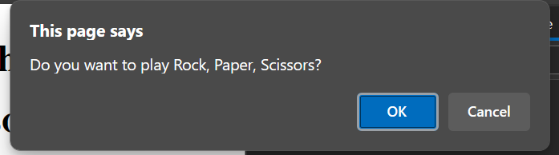

# ✊🖐✌️mini-project-rock-paper-scissors
This is the mini-project of the Week #3.

## Description

This is a simple Rock, Paper, Scissors game implemented in JavaScript. Here's a brief explanation:

The game starts by asking the user if they want to play Rock, Paper, Scissors using the confirm() function. 
If the user agrees to play, they are prompted to choose either rock (R), paper (P), or scissors (S).

The user's choice is then processed in the user() function. The function converts the user's input to lowercase and checks if it matches "r", "p", or "s". Depending on the user's choice, the function returns the corresponding string "rock", "paper", or "scissors".

The computer's choice is randomly generated in the computer() function. It uses Math.random() to generate a random number, which is then used to decide between rock, paper, or scissors.

The compare() function compares the user's choice and the computer's choice to determine the winner. It updates the wins, losses, and ties counters accordingly.

After each round, the results are printed to the console, and the user is asked if they want to play again. If the user agrees, the game repeats. If not, the game ends.

## Table of Contents

- [Credits](#credits)
- [License](#license)
- [Appearance](#website)

## Credits

N/A

## License

Please refer to the LICENSE in the repo.

## Website

This is the link to the live application: https://nathaliareyes.github.io/mini-project-rock-paper-scissors/

The following image shows the web application's appearance and functionality:

---

## Badges

## Thanks for stopping here!.
